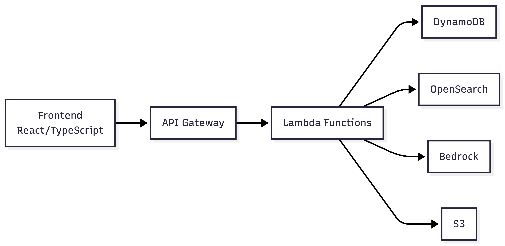
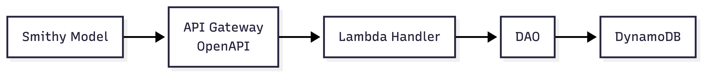
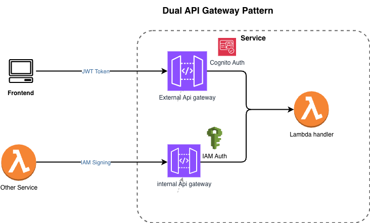
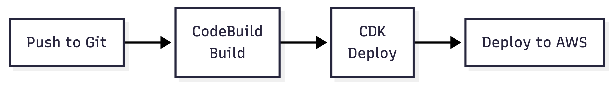
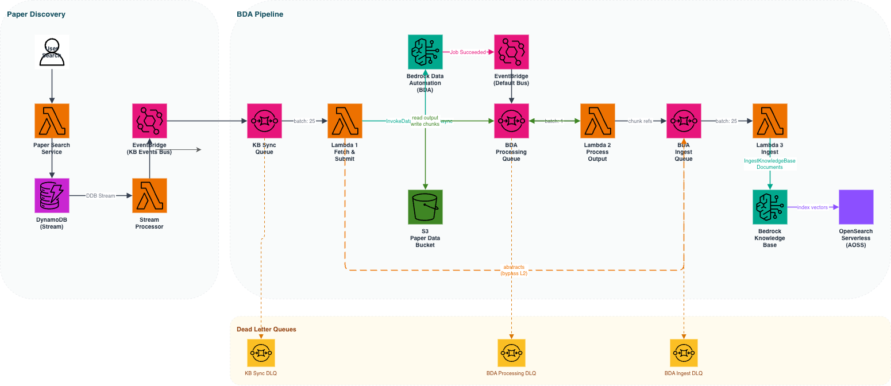
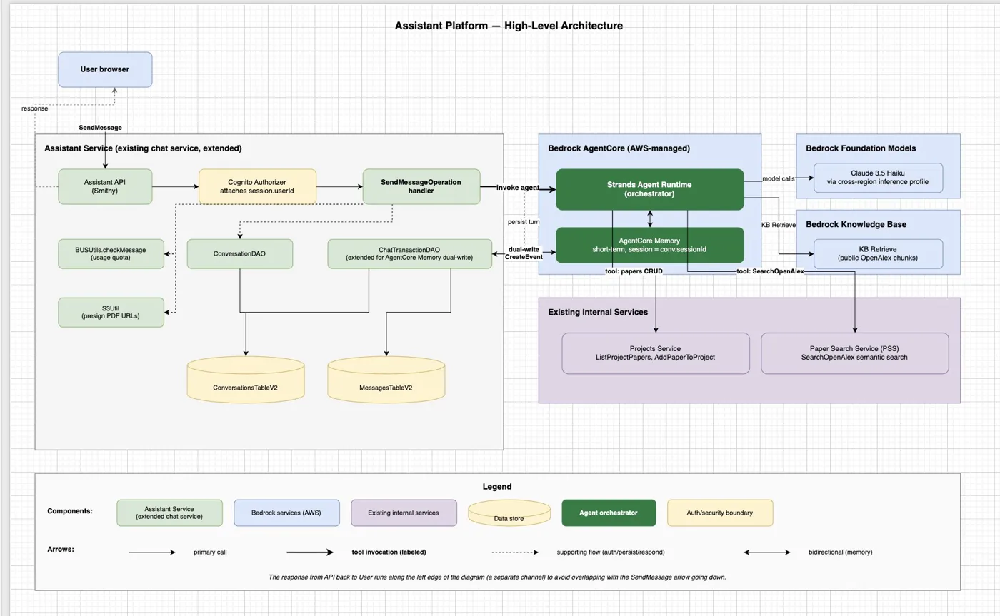
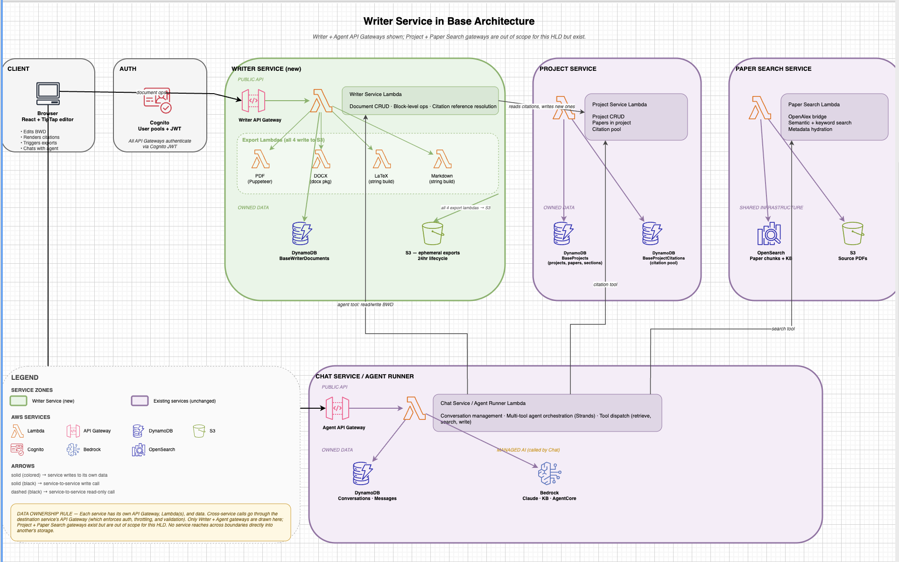
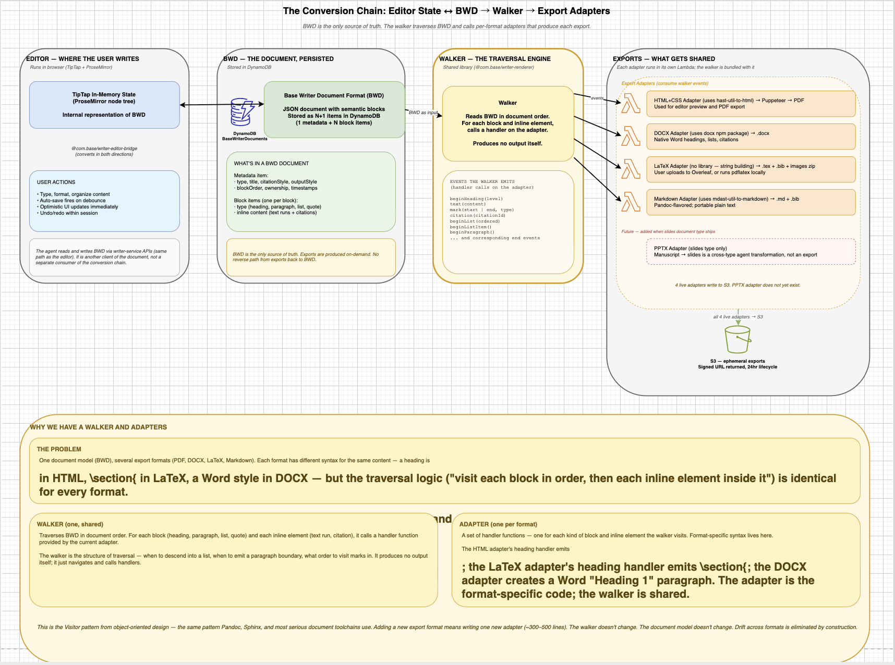
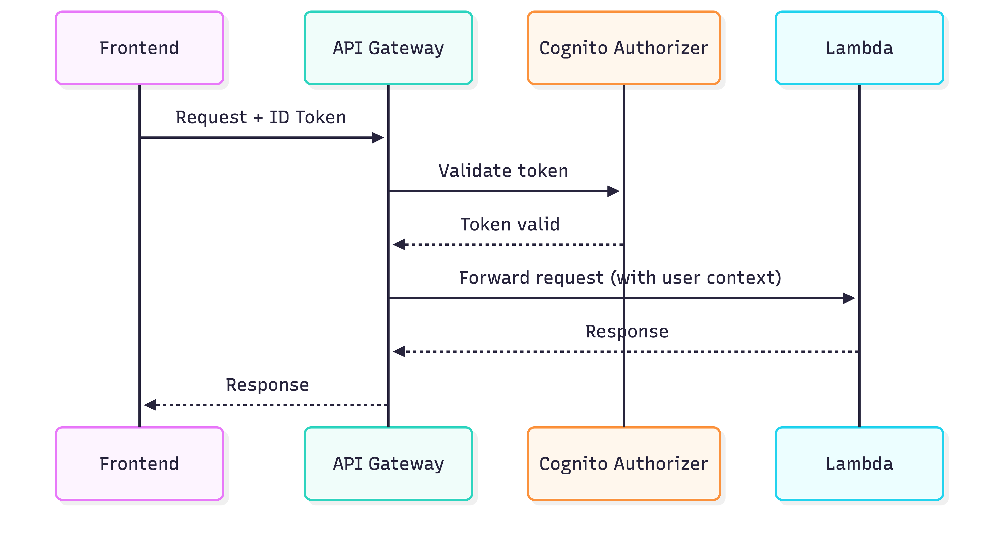

# Base — Architecture Case Study

> An agentic AI workspace for researchers: semantic search across 470M+ academic papers, AI chat with page-level citations, visual citation networks, and an in-app manuscript writer with multi-format export. Built and operated end-to-end by a single engineer on a serverless-first AWS stack.

**This is a public architecture write-up.** The application code is private; this document walks through the system design, the non-obvious decisions, and the tradeoffs behind them. A demo video and live app are linked at the bottom.

---

## Engineering highlights

- **Serverless-first, event-driven** platform on AWS Lambda + API Gateway + DynamoDB, defined with contract-first **Smithy** APIs and deployed entirely via **AWS CDK** with a CodePipeline → CodeBuild → CDK CI/CD flow.
- **A fully event-driven RAG ingestion pipeline** that turns a raw PDF into searchable, citation-grounded, spatially-traceable chunks — three decoupled stages, async document parsing, dead-letter queues, and tuned batch/concurrency per stage.
- **An agentic assistant** built on a tool-calling agent runtime with working-memory separation, per-tool authorization, cross-tenant safety, and a forward-compatible structured-response contract.
- **A document system** with one canonical semantic model fanning out to four export formats (PDF, DOCX, LaTeX, Markdown) via a single shared traversal and per-format adapters — the Visitor pattern, the way Pandoc and Sphinx do it.

---

## 1. System overview

Base is a serverless-first platform on AWS. A React/TypeScript frontend talks to a set of independent backend services, each one an API Gateway in front of Lambda, each owning its own DynamoDB data.

| Layer | Technology |
| --- | --- |
| Frontend | React, TypeScript, Tailwind, shadcn/ui (React Query + Zustand) |
| API layer | API Gateway + Cognito authorizer |
| Compute | AWS Lambda (Node 20 / TypeScript; Python for the agent runtime) |
| API contracts | Smithy (codegen for server SDK, OpenAPI, client SDK) |
| Data | Amazon DynamoDB (per-service tables) |
| Vector search | OpenSearch Serverless |
| AI / RAG | Amazon Bedrock (Claude), Titan V2 embeddings, Bedrock Knowledge Base |
| Document parsing | Bedrock Data Automation |
| Object storage | Amazon S3 |
| Auth | Amazon Cognito |
| IaC | AWS CDK (TypeScript) |
| CI/CD | CodePipeline + CodeBuild |
| Monitoring | CloudWatch + Amplitude |

The backend is a set of focused services — chat/agent, paper search, projects, knowledge-base ingestion, visualization, writer, usage, and payments — rather than a monolith. The driving reasons were independent deployability, blast-radius isolation, and per-service data ownership.

### Cross-cutting design decisions

**Contract-first APIs with Smithy.** Every service defines its operations, request/response shapes, HTTP bindings, and authorization in a Smithy model. A build step generates the server SDK (typed handlers), an OpenAPI spec (imported directly by API Gateway), and a client SDK that other services consume. The payoff: the API contract is the single source of truth, and cross-service calls are type-checked at compile time rather than discovered at runtime.

**Dual API Gateway pattern.** Each service exposes two gateways routing to the *same* Lambda handler: an external gateway authorized by the Cognito user pool (for the frontend) and an internal gateway authorized by IAM (for service-to-service calls). This cleanly separates the two trust boundaries without duplicating business logic — user traffic and service traffic authenticate differently but execute identically.

**Per-service data ownership.** No service reaches into another service's tables. All cross-service interaction goes through the service's API. This keeps schemas free to evolve behind their owners and makes the data dependencies explicit and auditable.

**Everything as code.** All infrastructure is AWS CDK. A push to the service branch triggers CodePipeline → CodeBuild (`npm install`, Smithy + TypeScript build, `cdk synth`) → CDK deploy, which rolls forward Lambda, API Gateway, and DynamoDB schema changes together. Rollback is a code revert.

---

## 2. Knowledge Base — event-driven RAG ingestion pipeline

**The problem.** When a user searches, Base discovers new papers from OpenAlex and needs to turn each raw PDF into chunks that are (a) semantically searchable, (b) traceable to an exact location in the source PDF for in-app highlighting, and (c) linked to other papers via their citations. Parsing a PDF this richly is slow and asynchronous, and a search can surface dozens of papers at once. A synchronous "fetch → parse → embed → index" call would block, time out, and fail as a unit.

**The design.** A fully event-driven, fully serverless pipeline in three decoupled stages, so that slow async parsing never blocks discovery and each stage scales and fails independently.

1. **Discover → publish.** When the paper-search service writes a newly-discovered paper to DynamoDB, a DynamoDB Stream processor watches for inserts with an unstarted sync status and publishes a *Paper Discovered* event to a dedicated EventBridge bus. This decouples discovery from ingestion entirely — the search service knows nothing about the KB pipeline.
2. **Fetch & submit.** A Lambda pulls batches off a queue, downloads each PDF to S3 (falling back to the abstract when no PDF is available), and kicks off **asynchronous** document parsing via Bedrock Data Automation — then exits immediately without waiting. Papers with only an abstract skip parsing entirely and route straight to ingestion.
3. **Process parsed output.** When parsing finishes, it fires its own completion event; a Lambda reads the element-level output (text, tables, figures — each with bounding boxes), fetches the paper's referenced works from OpenAlex, builds a bibliography→ID reference map for citation linking, writes per-chunk files to S3, and enqueues one message per chunk.
4. **Ingest.** A final Lambda batches chunks into the Bedrock Knowledge Base, which embeds them with Titan V2 into OpenSearch Serverless. Per-document failures are retried individually via partial-batch-failure reporting.

### Decisions and tradeoffs

- **Async parse, exit immediately.** The fetch stage never holds a Lambda open waiting for a multi-second parse. Parsing completion is itself an event. This is the difference between a pipeline that handles a burst of papers and one that hits Lambda timeouts under load.
- **Tuned batch size and concurrency per stage.** Each stage has different cost and throughput characteristics — bulk metadata fetch wants large batches; one-paper-per-parse-completion wants a batch size of one; chunk ingestion wants large batches again. Each queue is tuned independently rather than with a single global setting.
- **Pre-chunked data source.** Rather than letting the managed Knowledge Base parse and chunk, parsing and chunk-boundary decisions are owned upstream. This trades some managed convenience for full control over chunk boundaries, metadata, and the reference mapping that powers citation links — which is the product's whole point.
- **DLQs everywhere, status as a state machine.** Every queue has a dead-letter queue; every paper carries an explicit ingestion status in DynamoDB. A stuck paper is visible and re-drivable rather than silently lost.

---

## 3. Agentic assistant — from retrieve-then-generate to a tool-calling agent

**The problem.** The original chat was a single retrieve-then-generate pass: build a metadata filter, retrieve from the knowledge base, inject into a prompt, generate. It could answer questions about papers but couldn't *act* — it couldn't search for new papers, add them to a project, or reason across multiple steps.

**The design.** Replace the engine, preserve the experience. The chat surface — same UI, same `[N:page]` citations, same API contract — is kept intact while the engine becomes a tool-calling agent on a managed agent runtime. v1 ships three tools (`getProjectPapers`, `searchOpenAlex`, `addPaperToProject`) that unlock one genuinely new capability: *"find me relevant papers based on our conversation"* — the agent reads project state, synthesizes a query from the conversation, searches, dedupes against existing papers, and presents candidates the user can then add.

### Decisions and tradeoffs

- **Working memory vs. system of record, kept separate.** The agent runtime's memory holds transient working context; the DynamoDB messages table remains the durable system of record. Conflating the two is how you get state that's authoritative in one place and stale in another.
- **Security-critical session wiring.** The agent's memory is keyed by user and conversation. Wrong values cause memory to bleed across users — so those values are derived from the authorizer-attached identity, never from the request body, and asserted in an integration test. A pre-existing gap (`userId` falling back to a request-body field) was closed as part of this work.
- **Per-tool authorization, identity closed over.** Tools receive only content arguments from the agent (e.g. a search query). User and project identity are closed over from the authenticated session, never passed by the model — so a hallucinated argument can't escalate scope.
- **A forward-compatible structured-response contract.** The agent emits typed response *components* (an answer, a search-results card, an add-confirmation, an explicit "I couldn't help and here's why"). The frontend renders by type and *skips unknown types*, so new agent capabilities can ship without a lockstep frontend release. The backend always guarantees at least one text component as a fallback.
- **Ruthless scope discipline.** The design is as notable for its explicit *non-goals* as its goals: no streaming, no long-term memory, no eval suite, no feature flags in v1 — each a deliberate, documented choice revisited only when user signal warrants. Bounded blast radius (public-only content, small user base, code rollback in minutes) made that lean posture safe. A per-turn tool-call cap bounds both latency and cost.

---

## 4. Writer service — one document model, four export formats

**The problem.** Researchers used Base to *find and analyze* papers, then left for Word, Google Docs, or Overleaf to *write* — and the chunk-level citation grounding Base had produced was lost in the move. The writer closes that loop: compose in Base, keep citations as first-class grounded elements, export anywhere.

**The design.** It rests on a few hard architectural commitments:

- **One source of truth.** The document is stored once, in a canonical format the service owns. The editor's in-memory state and every export (PDF, DOCX, LaTeX, Markdown) are *derivations* of that canonical form — never alternative sources, never round-tripped through DOCX. One direction of truth fanning out to many representations.
- **Semantic structure, not visual styling.** The model captures *what* content is (heading, paragraph, citation, list item), not how it looks. Styling is the renderer's job, per format. This is what makes export to many formats tractable at all.
- **Walker-and-adapter (Visitor) pattern.** A single shared traversal reads the document and emits format-agnostic events; per-format adapters consume those events and produce output. Adding a new export format means writing one new adapter — the model and traversal don't change. The same pattern Pandoc and Sphinx use.
- **The agent is just another client.** The assistant edits documents through the *same* API the editor uses — same auth, same validation. Its effect on the document is therefore bounded and auditable by construction, not by a separate trusted path.

### Decisions and tradeoffs

- **Buy where libraries fit, build where they don't.** TipTap/ProseMirror for the editor, the `docx` package for Word, `mdast`/`hast` for Markdown/HTML, Puppeteer for PDF — and a hand-written LaTeX adapter, because no good library exists for that direction. The bespoke code (schema, walker, adapters, editor-bridge) is ~20% of the codebase; the rest is library glue. Knowing which 20% to build is the point.
- **Runtime substrate chosen per ecosystem, not for uniformity.** Writer Lambdas run TypeScript because the entire document toolchain (ProseMirror, `docx`, Puppeteer, `hast`/`mdast`) is JavaScript-native, and TypeScript's discriminated unions make the walker's exhaustive per-block dispatch compile-time-safe. The agent runtime is Python because its agent framework is Python-only. Language follows the dominant library ecosystem rather than fighting it.
- **Per-service ownership held firm.** The writer owns its documents in its own table and resolves citation metadata from the projects service through its API — it never reads another service's data directly.
- **Separate export Lambdas.** Each format renders in its own Lambda (e.g. a memory-sized ARM64 Lambda for DOCX, a separate one for PDF/Puppeteer), so a heavy PDF render can't starve a Markdown export, and each can be sized and shipped independently.

---

## 5. Cross-cutting concerns

**Auth.** Cognito user pools issue JWTs; API Gateway authorizers validate signature, expiration, and issuer before any Lambda runs. Service-to-service calls authenticate with IAM signing over the internal gateways. User identity in handlers always comes from the authorizer context, never the request body.

**Analytics.** A DynamoDB-Streams → S3 data-lake path captures usage events without coupling product writes to analytics, alongside CloudWatch for operational metrics and Amplitude for product analytics.

**Payments & usage.** Subscription billing and per-user usage metering (which gates message quotas in the chat/agent path) are their own services behind the same patterns.

---

## 6. What's deliberately deferred

A recurring theme across these designs is writing down what is *not* being built and why: streaming responses, long-term cross-conversation memory, real-time collaborative editing, multi-agent handoff, formal eval/regression suites, and phased rollouts with shadow traffic. Each is a real future need, scoped out of v1 on purpose and tied to a concrete trigger (private-content support, traffic growth, multi-tenant data) that would justify the cost. Shipping the smallest thing that lets a user validate the idea — then earning the next layer of infrastructure with real signal — was the operating principle throughout.

---

## Links

- **Demo video:** _[Loom link]_
- **Live app:** _[app link]_
- **Author:** Purna Srivatsa Boggavarapu — [LinkedIn] · [Portfolio]

> _Note: metrics to add where you can defend them — papers/chunks indexed, active/beta users, deploy frequency, end-to-end ingestion latency. Even a couple of real numbers turn this from "well-designed" into "well-designed and operating."_
